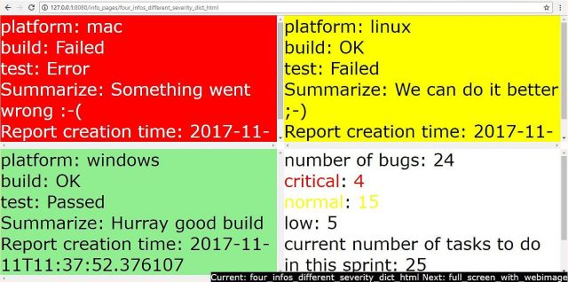

Pluggable Info Monitor
======================

Pluggable Info Monitor is a web application to display information provided by plugins on a web page.

PIM for the Visibility and Transparency
---------------------------------------

Quick Start
-----------
1. Install requirements
::

    pip install flask
    pip install waitress

2. Copy the source to a folder of your choice
3. Check working:

    a. ``cd <path_to_info_monitor.py>``
    b. ``python info_monitor``
    c. in a browser window navigate to ``127.0.0.1:8080`` address 
    d. the example plugins give some info - It works ;-)

4. You can write your plugins using the examples

Usage
-----
The index page will show the list of available plugins as links. These links can be used if PIM used interactively. 
The info pages will be changed (the next is showed) in every minute (can be changed in PIM_config.py).
If used interactively, the info refreshes on keypress too.

To be useful for you, you have to write your own info providers according to examples.

The check_info_provider_interface.py checks the most important things of your plugins. 
(Can be started from the folder it resides)

Next version will be better. ;-)

Configuration
-------------
Serving IP address, port, refresh time interval can be set in PIM_config.py file

Compatibility
-------------
PIM needs at least Python 3.1

Features and versions:

- format string: Python 3.6 https://docs.python.org/3/reference/lexical_analysis.html#f-strings If you have earlier version of Python, you should replace these string formattings
- reload imported module in runtime: Python 3.4 If you have earlier version of Python if application runs and you edit the info provider plugin, after editing the application must be restarted
- import module runtime: Python 3.1 https://docs.python.org/3/library/importlib.html#importlib.import_module

ToDo / Planned features
-----------------------
- COnfigurable font size
- Configurable plugin folder outside of the program
- Start plugin checking from web and get results as well
- Package creation fro easier installation; using in virtualemv it can be installed with user privileges

Screenshot
----------

One module gives four information with different severity levels

TL;DR
-----

History
-------
During development, specially in agile methodologies there is need to monitor the status of the development. So teams used to check the build status, test results, number of bugs etc. (Like Jenkins's build monitor plugin (aka radiator))
So the idea came from this: Jenkins build monitor can show only the status of the jobs. And I wanted a tool that shows / monitors other things as well. (This is my first Python web application ;-) )

How PIM works
-------------
0. PIM webpage is loaded in a browser (if not called, PIM does nothing)
1. Index page is displayed. Clicking on a provider will display the info provided by the given provider. If no provider is clicked, the first will be selected automatically.
2. gets the info from the provider
3. creates a web page with the info it gathered. There are two parameters now which can modify the way the info is dispalyed. Severity (gives background color) and display splitting (full screen, half, quarter)
4. PIM goes through the providers (ordered alphabetically by their name) and after the last one it starts the cycle from the first one.

Where the displayed info comes from?
------------------------------------
You write the info provider plugins. The plugins must be put into info_providers folder. The providers must provide the info in the following structure

::

    one_info = {
        'display_part': DisplayParts.FULL_SCREEN,
        'info_severity': InfoSeverity.INFO,
        'info': {
            'key_1': 42,
            'key_2': 'spam',
            'key_3': 'eggs',
        },
    }

    info_to_display = list()
    info_to_display.append(one_info)

Installation
------------

Requirements
^^^^^^^^^^^^

- Flask webframework

  https://pypi.python.org/pypi/Flask
  ::

    pip install flask

- Waitress webserver

  https://pypi.python.org/pypi/waitress
  ::

    pip install waitress

- Optional:PyTest test framework to execute PIM tests and the more important thing: to verify your plugins whether they comply to interface requirements.

  https://pypi.python.org/pypi/pytest/
  ::

    pip install pytest

PIM has is no any install procedure right now. You can get PIM from the source.

Contribution
------------

Contributions are welcome.

To report any issue / feature request, use the issue tracker:

https://bitbucket.org/GeorgeFischhof/pluggable_info_monitor/issues

To contribute code, you can fork / clone it and create a pull request.
